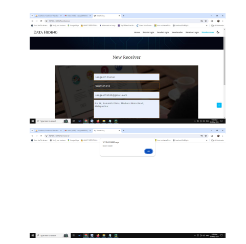
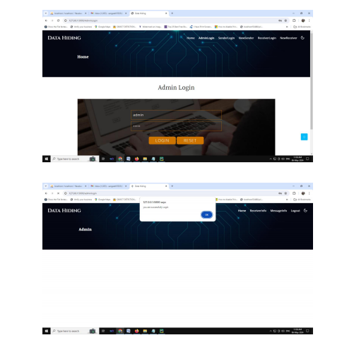
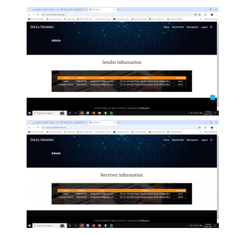
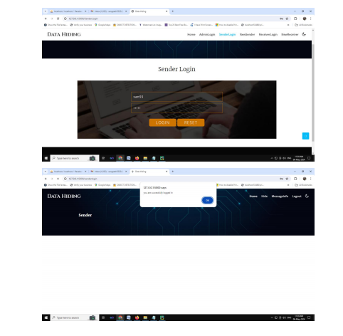
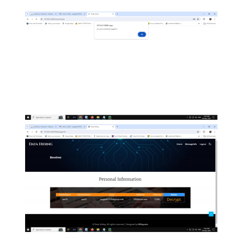
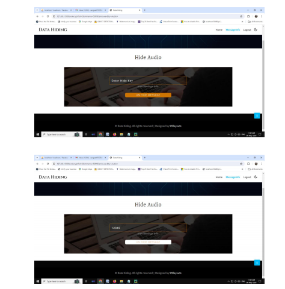
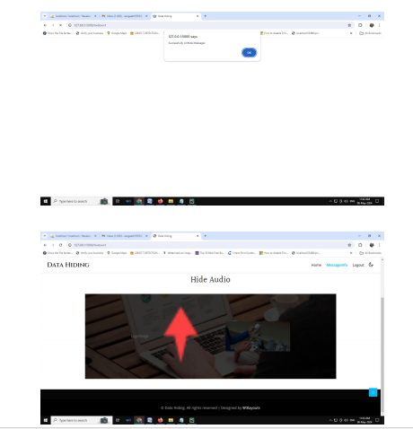

FFT-Based Dual Mode Blind Watermarking Hiding Binary Logos and Color Images into Audio

This project implements a dual-mode blind watermarking technique to embed a binary logo and a color image into audio files using the Fast Fourier Transform (FFT). The watermarks are embedded in the frequency domain of the audio, ensuring that they are imperceptible to the human ear while still being extractable without needing the original audio file.

## Features

- **Dual Mode Watermarking**: Embeds both a binary logo and a color image into an audio file.
- **FFT-Based Technique**: Uses the Fast Fourier Transform (FFT) to transform the audio into the frequency domain for embedding watermarks.
- **Blind Watermarking**: The watermarks can be extracted without the need for the original audio, making it a robust and secure method.
- **Audio Support**: Works with common audio formats (e.g., WAV, MP3).
- **Preservation of Audio Quality**: The embedding process ensures minimal distortion to the original audio.

## Requirements

- Python 3.x
- NumPy
- SciPy
- Matplotlib (optional for visualization)
- pydub (for audio file handling)
- OpenCV (optional for processing images)

You can install the required Python libraries using the following command:

```bash
pip install numpy scipy matplotlib pydub opencv-python
```

## Installation

1. Clone the repository to your local machine:

```bash
git clone https://github.com/yourusername/fft-based-watermarking.git
```

2. Navigate to the project directory:

```bash
cd fft-based-watermarking
```

3. Install the dependencies as mentioned above.

## Usage

### 1. Embedding the Watermarks

To embed the binary logo and color image into an audio file, use the following command:

```bash
python embed_watermark.py --audio_input <path_to_audio> --logo_input <path_to_logo> --image_input <path_to_image> --audio_output <path_to_output_audio>
```

- `--audio_input`: Path to the input audio file.
- `--logo_input`: Path to the binary logo image (black and white).
- `--image_input`: Path to the color image file (JPG, PNG, etc.).
- `--audio_output`: Path to save the output audio with embedded watermarks.

### 2. Extracting the Watermarks

To extract the embedded binary logo and color image from the audio file, use the following command:

```bash
python extract_watermark.py --audio_input <path_to_audio> --logo_output <path_to_logo_output> --image_output <path_to_image_output>
```

- `--audio_input`: Path to the input audio file containing the watermarks.
- `--logo_output`: Path to save the extracted binary logo.
- `--image_output`: Path to save the extracted color image.

## Code Structure

- `embed_watermark.py`: Script for embedding the binary logo and color image into the audio file.
- `extract_watermark.py`: Script for extracting the binary logo and color image from the watermarked audio file.
- `utils.py`: Helper functions for FFT processing and watermark embedding/extraction.

## How It Works

1. **Preprocessing**:
   - The binary logo is converted into a binary matrix.
   - The color image is resized and converted to a suitable format for embedding.
   
2. **FFT Transformation**:
   - The audio is transformed into the frequency domain using FFT.
   - The watermark data is embedded into the frequency coefficients of the audio.

3. **Embedding**:
   - The binary logo is embedded into selected frequency ranges that minimize perceptibility.
   - The color image is embedded using a similar technique, with a larger range of frequency coefficients.

4. **Extraction**:
   - To extract the watermark, the frequency domain is analyzed, and the watermark data is recovered by using the inverse FFT.

## Example

1. **Embedding**:

```bash
python embed_watermark.py --audio_input sample_audio.wav --logo_input logo.png --image_input image.jpg --audio_output watermarked_audio.wav
```

2. **Extraction**:

```bash
python extract_watermark.py --audio_input watermarked_audio.wav --logo_output extracted_logo.png --image_output extracted_image.jpg
```

## Future Improvements

- **Compression Resistance**: Improve resistance to audio compression algorithms like MP3.
- **Additional Formats**: Extend support for other audio formats (e.g., OGG, FLAC).
- **GUI Interface**: Create a graphical user interface (GUI) for easier interaction.

## License

This project is licensed under the MIT License - see the [LICENSE](LICENSE) file for details.

---












